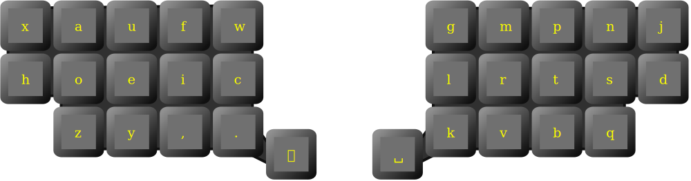

# Ant layout

Ortholinear carpalx optimized layout with adaptive thumb key.

Adaptive key is
 * **n** after **eaoiu** vowels
 * **a** otherwise

Some documentation and resources (carpalx report, json configuration) are available at [https://lykt.xyz/rtsd/#ant](https://lykt.xyz/rtsd/#ant)
