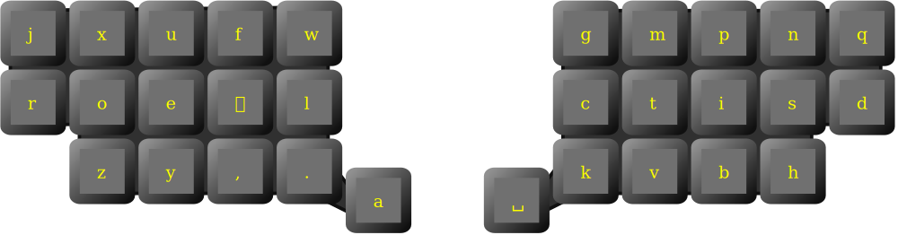

# Horn layout

Ortholinear carpalx optimized layout with adaptive key.

Adaptive key is
 * **n** after vowels and consonants other then **tscpgwx**
 * **h** otherwise

Some documentation and resources (carpalx report, json configuration) are available at [https://lykt.xyz/horn/](https://lykt.xyz/horn/)
