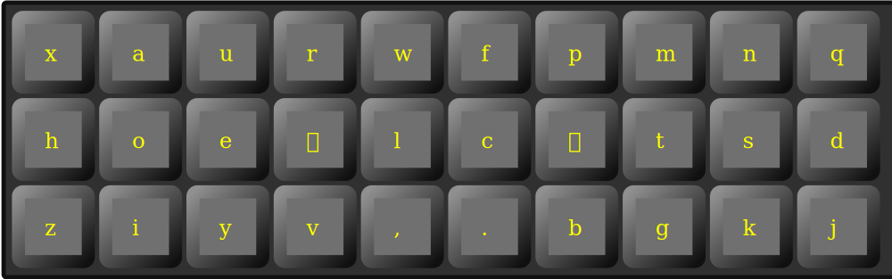

# Adaptive layout

Ortholinear carpalx optimized layout with two adaptive keys.

Left adaptive key is
 * **n** after **eaoiu** vowels
 * *space* after *full stop*
 * **a** otherwise

Right adaptive key is 
 * **r** after **eaoiu** vowels
 * *space* after *comma*
 * **i** otherwise
