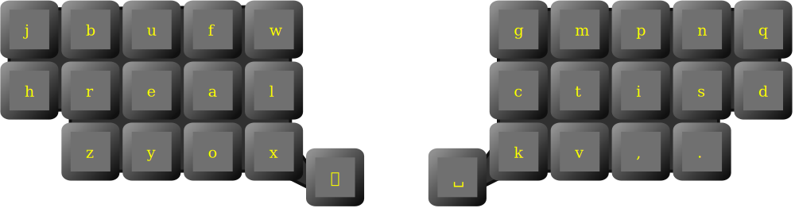

# Real layout

Ortholinear carpalx optimized layout with adaptive thumb key.

Adaptive key is
 * **n** after **eaoiu** vowels
 * **o** otherwise

Some documentation and resources (carpalx report, json configuration) are available at [https://lykt.xyz/seal/#real](https://lykt.xyz/seal/#real)
