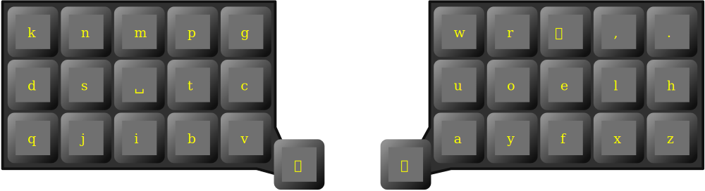

# Rina layout

Ortholinear carpalx optimized layout with two adaptive thumb keys.

Left adaptive key is 
 * **r** after **eaoiu** vowels
 * **i** otherwise
 
Right adaptive key is
 * **n** after **eaoiu** vowels
 * **a** otherwise

Some documentation and resources (carpalx report, json configuration) are available at [https://lykt.xyz/nari/#rina](https://lykt.xyz/nari/#rina)
