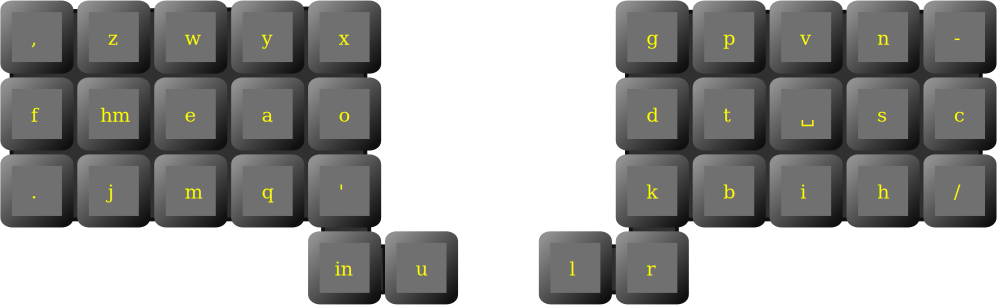

# Unit layout

Ortholinear carpalx optimized layout with two adaptive keys.

Left adaptive key returns
 * **m** after vowels and consonants other then **tscpgwx**
 * **h** otherwise

Right adaptive key returns
 * **n** after **eaoiu** vowels
 * **i** otherwise

Some documentation and resources (carpalx report, json configuration) are available at [https://lykt.xyz/uno/#unit](https://lykt.xyz/uno/#unit)
